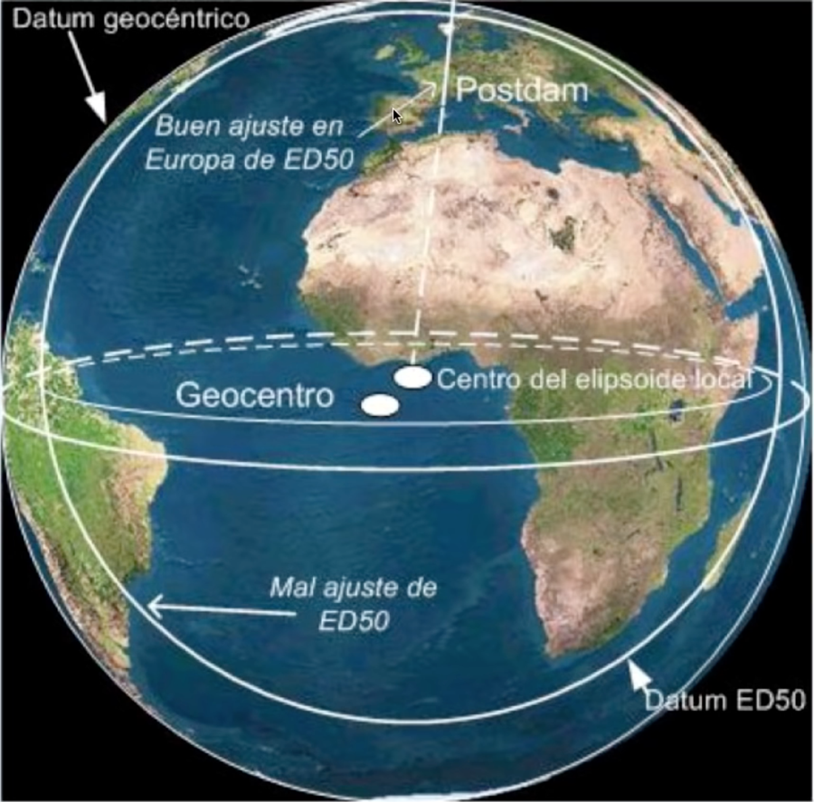
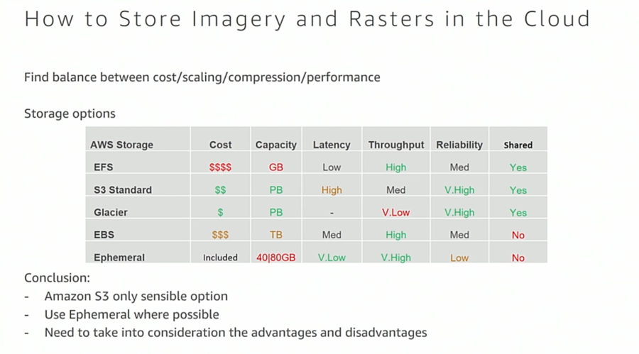

# ¿Qué significa el término GIS?

El término significa **Geographic Information Systems**, (**SIG** en castellano)

Los sistemas de Información Geográfica se pueden entender como la organización y coordinación de distintos elementos de información relativos al espacio geográfico.

Esto no significa que sea un campo de conocimiento exclusivo de los geógrafos. En los **GIS** participan un montón de disciplinas:

- Geodesia
- Cartografía
- Topografía
- Ciencias Ambientales
- Ingeniería Civil (Caminos y Puertos)
- Aeronáutica
- Astronomía
- Arquitectura
- Militar
- ...

En el fondo, todo fenómeno tiene una componente espacial. De ahí que haya tantas profesiones que usan los GIS en su trabajo diario.

# ¿Para qué sirven los sistemas GIS? ¿Qué aplicaciones tiene?

Pues en realidad podríamos hacer una lista infinita. Pero mejor os dejo un enlace en el que podéis encontrar categorizadas más de 1000 aplicaciones distintas con ejemplos:

[Aplicaciones del GIS](https://gisgeography.com/gis-applications-uses/)

# ¿Cómo funciona un GIS y qué tipo de información maneja?

Una imagen vale más que mil palabras.

Toda esta información debe estar **GeoReferenciada** y dependiendo de la representación tipo de información podemos clasificarla en 3 grandes grupos:

- Imagery(Raster)
- Vectorial
- Tabular

> Más adelante describiremos:
* el porqué de cada formato
* qué tipo de información muestra
* cómo se estructura esa información.

## ¿Cómo se geo-referencia?

Aquí está una de las claves en las que todos los iniciados en el mundo GIS solemos caer en error. Voy a tratar de explicarlo paso a paso.

### Las mediciones siempre son relativas

En primer lugar hay que tener en cuenta que toda medición es **relativa** y tiene márgenes de error. Los distintos sistemas de referencia tratan de ajustarse lo máximo posible a un área concreta de estudio, para minimizar precisamente ese error.

### Sistemas de Referencia

Para entender un sistema de referencia, vamos a usar la siguiente imagen:

Cualquier sistema de referencia se compone de dos partes:

- Elipsoide
- Datum

#### Elipsoide

Podemos definirlo como la formulación matemática del **Geoide** (la forma que tiene la tierra, para entendernos)

#### Datum

Es un conjunto de puntos de referencia en la superficie terrestre con los cuales las medidas de la posición son tomadas y un modelo asociado de la forma de la tierra (elipsoide de referencia).

Más adelante cuando veamos los **sistemas de coordenadas** veremos que hay dos tipos de datums:

- Horizontales
- Verticales

> Aquí puedes consultar algunos de ellos, para hacerte una idea [Lista de Elipsoides y Datums](https://www.globalsecurity.org/military/library/policy/usmc/mcwp/3-16-7/draft_appa.pdf)

### ¿Por qué hay distintos sistemas de Referencia?

Cada país suele escoger el sistema de referencia que más se ajuste a su territorio.

#### Sistema de Referencia oficial en España

Para la península se estableció el **ETRS89** y para las Islas Canarias el **REGCAN95** . Anteriormente se utilizaba el **ED50**.

El ETRS89 está basado en el elipsoide **GRS80**.

Y te preguntarás, ¿por qué dos sistemas de referencia para España? . La respuesta es porque Canarias está en una zona próxima a dos placas tectónicas, y como ya sabréis, las placas tectónicas se desplazan, por lo que cada cierto tiempo hay que hacer ajustes.

#### Sistema de Referencia Global WGS84

Es el utilizado por el **GPS** o **NAVSTAR**, que es un sistema de posicionamiento global que a todo el mundo le suena, pero que quizás no sepas que es un sistema "cedido" por el Departamento de Defensa de EEUU.

Los europeos tenemos también nuestro sistema de posicionamiento global: [**Galileo**](https://www.esa.int/Our_Activities/Navigation/Galileo/What_is_Galileo)

#### Compatibilidad entre el ETRS89 y el WGS84

Aunque están basados en distintos elipsoides, la diferencia es conocida, con lo que se puede hacer la traslación de la georeferencia de un sistema a otro.

#### ¿Cómo hago para transformar mis datos si los tengo en un sistema de referencia distinto?

Aquí es donde empieza a liarse la cosa.

Por un lado necesitamos identificar unívocamente cada sistema de referencia. Y el problema es que nos vamos a encontrar varias nomenclaturas:

- [EPGS](http://www.epsg.org/)
- [WKID y WKT](http://spatialreference.org/)

> En la mayoría de Software para producción cartográfica, a la hora de cargar capas de información, debéis aseguraros de que todas las capas estén en el mismo sistema de referencia y proyección, para que el estudio sea coherente y no haya errores.

> Os recomiendo que le echéis un vistazo a este [post](http://www.gisandbeers.com/equivalencia-codigos-epsg-sistemas-referencia/) de [@GIS_and_Beers](https://twitter.com/GIS_and_Beers), para tener a mano los identificadores más comunes cuando estemos haciendo análisis espaciales centrados en España.

### Sistemas de Coordenadas

#### Horizontal

Para localizar un punto en el plano.

#### Vertical

Para localizar la elevación de un punto.

### Proyecciones

Las proyecciones son la consecuencia de querer identificar en un plano cualquier punto del planeta (algo aproximado a una esfera, aunque está achatada por los polos). Esta operación siempre supone una distorsión. Y aquí viene lo que para mucha gente pasa desapercibido.

Los mapas que vemos habitualmente en la web,usan una proyección llamada **Mercator**, que altera la percepción del tamaño de los países.

¿De dónde viene esto?

**Google Maps** popularizó el consumo de mapas en la web. Durante mucho tiempo usaron la proyección **Mercator** para representar los mapas. ¿Conspiranoia Mundial? No, todo tiene una razón, y aquí os dejo la [explicación](https://productforums.google.com/forum/#!topic/maps/A2ygEJ5eG-o) .

A día de hoy, la cosa cambia. Probad a alejar el zoom en Google Maps y lo comprobaréis por vosotros mismos.

Lo que creo que es más importante recordar respecto a las proyecciones es que en tus análisis debes escoger para tu estudio qué propiedad quieres preservar:

- Forma
- Área
- [Distancia](http://ekenes.github.io/esri-js-samples/ge-length/)
- Dirección

y a partir de ahí escoger una proyección adecuada a esa propiedad.

[Motor de proyecciones en el navegador](https://www.esri.com/arcgis-blog/products/js-api-arcgis/mapping/introducing-the-client-side-projection-engine/)

[Demo](https://ubatsukh.github.io/pe-gs-projection/)

> [Game of Geodesics](https://apl.esri.com/jg/GeodesicsGame/index.html)

#### Explorando Proyecciones

[https://maps.esri.com/jg/Distortion/index.html](https://maps.esri.com/jg/Distortion/index.html)

> Aquí tienes una [lista](https://es.wikipedia.org/wiki/Anexo:Cronolog%C3%ADa_de_las_proyecciones_cartogr%C3%A1ficas) de los tipos de proyecciones.

## Fuentes de Datos GIS

Ahora que hemos visto como georeferenciar puntos del planeta, es interesante el ver cómo obtenemos los datos y qué tipo de datos se emplean en el GIS.

Como comentamos al principio, se puede hacer una clasificación por tres grandes grupos:

- Imagery(Raster)
- Vectorial
- Tabular

Vamos a ver **características** de cada uno de estos grupos, qué **tipo de información** suelen aportar y en qué **escenarios** se suelen emplear dentro de un análisis espacial.

### Imagery (Raster)

Dentro de esta categoría tenemos varios tipos en función de como se obtiene la imagen:

- Óptico
- Radar
- FMV
- Categórica
- Científica

> Como curiosidad podéis ver esta [demo](https://maps.esri.com/rc/landsat-viewer/index.html#) para haceros una idea del proceso.

> Y si queréis saber cuántos satelites hay orbitando por ahí, mirad esta [demo](https://maps.esri.com/rc/sat/index.html)

En cuanto a la estructura de cómo se almacena la la información tenemos:

- Teselas / Cacheado
- Cubos de Datos / Científico
- OrtoMosaicos
- Escenas Rectificadas / No rectificadas

[Comparador de Ortofotos PNOA](http://contenido.ign.es/web/comparador_pnoa/index.html)

> **PNOA** -> Plan Nacional de OrtoFotografía Aérea

La estructura en el almacenamiento de este tipo de formato es clave para poder hacer un uso óptimo de ellas.

> [Optimización de Almacenamiento de Rasters](https://github.com/Esri/OptimizeRasters)

### Qué tipo de información puedo usar a partir de imágenes

Satélites como LandSat o Sentinel(Parte de la iniciativa Europea [**Copernicus**](https://www.youtube.com/watch?v=yv7pKLwXo5c)) , capturan imágenes en distintas bandas del espectro tanto visible como invisible y permiten mediante combinación de dichas bandas observar distintos fenómenos como **vegetación (NVDI)**, **Humedad(Moisture)**, etc...

> Si te interesa explorar más aplicaciones del **Remote Sensing** puedes consultar este [artículo](https://gisgeography.com/100-earth-remote-sensing-applications-uses/)

Dependiendo del tipo de estudio que se quiera hacer, a veces se emplean las imágenes en crudo, o bien se pueden emplear imágenes ya tratadas.

[Ejemplo - Sentinel-2 Views](http://www.arcgis.com/home/item.html?id=fd61b9e0c69c4e14bebd50a9a968348c)

[Aplicaciones web de Tratamiento de Imagen Satelital](https://github.com/Esri/Imagery-Apps)

### Vectorial

- Puntos
- Líneas
- Polígonos
- Nubes de Puntos ([Elevación](https://www.youtube.com/watch?v=0UwgPOAkx-c) / LIDAR)

[Vídeo de nube de puntos LIDAR](https://www.esri.com/videos/watch?videoid=3sQ-0ePc35Q)

[Valencia Urban Planning 2018](http://preventas.maps.arcgis.com/home/webscene/viewer.html?webscene=f268cecdb30e41f992f83d27b11a9e40)

[Lista de Objetos Geométricos](https://developers.arcgis.com/documentation/common-data-types/geometry-objects.htm)

Muchas veces oirás hablar de los **Vector Tiles**. Generalmente todo lo que tenga que ver con entidades, (aunque también los mapas base) encajan en esta categoría.

[Especificación original de los Vector Tiles](https://github.com/mapbox/vector-tile-spec)

#### Operaciones geométricas

[Creando aplicaciones con el Geometry Engine](https://www.youtube.com/watch?v=E2dW9CFku_o)

### Tabular

Una vez que tenemos un conjunto de datos geocodificados, las tablas se suelen usar como información añadida de las propiedades de un elemento, para dar más contexto.

Hay ciertos formatos de ficheros, en los que esa información ya viene embebida, como GeoJSON.

>  Tanto la información vectorial como la tabular se encuentra generalmente dentro de una **geodatabase** y se consume vía API REST.

### Servicios

- WFS
- WMS
- WCS
- WMTS
- GeoServicios
- GeoProcessing Services
- ...

Muchos de estos servicios están estandarizados por la [OGC](http://www.opengeospatial.org/)

## Tipos de Análisis Espacial

### Nuestra API en Python

[Documentación](https://developers.arcgis.com/python/guide/)

[Python API Github](https://esri.github.io/arcgis-python-api/apidoc/html/)

### Ejemplos

[Notebooks de Análisis Espacial](https://developers.arcgis.com/python/sample-notebooks/)

# Anexo

[Point Cloud Scene Layer Spec](https://github.com/Esri/pointcloud)

[I3S Spec](https://github.com/Esri/i3s-spec)

[Presentaciones de la Conferencia de Usuarios 2018](https://github.com/esri-es/conferencia-usuarios/tree/master/2018)

[Canal de Youtube de GeoDevelopers](https://www.youtube.com/channel/UC5Kegds6aV88wjdAhqQ5Wsg)

[Awesome Arcgis](https://esri-es.github.io/awesome-arcgis/)
